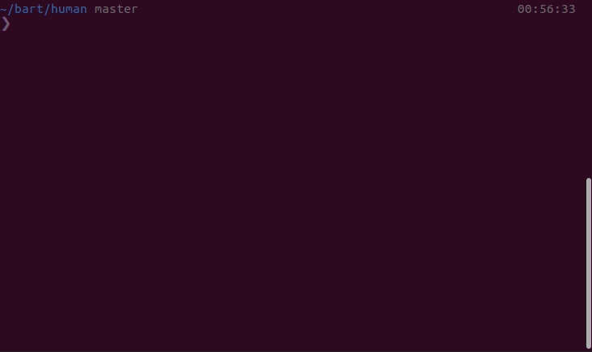

# Human

This repository is an attempt to implement human body as a code.

The goal is to learn how human body works and to challenge myself, as a programmer, on handling the implementation side of it.

All code is written in modern PHP with best coding practices, concepts and patterns in mind.

### Organs

At the moment there is only very rough and basic implementation of the heart.
The plan is to implement all possible organs known in human body.

### Heart beat demo

Below is a gif demonstrating beating of a heart. In our example, heart has default capacity of 10 and is trying to pump 50 volume of blood flowing in vessel connected to the heart.
At the end there is no blood left in connected vessel and heart is pumping nothing.

### Installation

You need these things on your system to run Human:
- PHP 7.4 (I haven't tested it on PHP 8 yet)
- Composer

Clone the repo and run:

    $ composer install

Then you can execute heart beat demo:

    $ php run.php